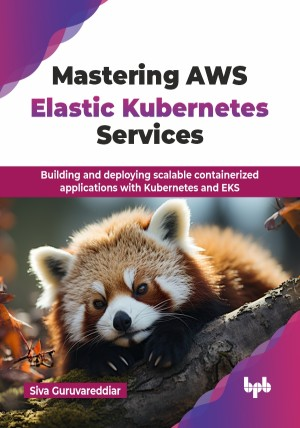

# Mastering AWS Elastic Kubernetes Services

Building and deploying scalable containerized applications with Kubernetes and EKS.

This is the repository for [Mastering AWS Elastic Kubernetes Services
](https://bpbonline.com/products/mastering-aws-elastic-kubernetes-services?variant=44257687961800),published by BPB Publications.

## About the Book
“Mastering AWS Elastic Kubernetes Services" is your comprehensive guide to understanding and implementing AWS EKS. This book helps you master Kubernetes, the industry-standard container orchestration platform, on the robust and scalable Amazon Web Services (AWS) cloud. 

This book is a complete guide to Kubernetes and AWS EKS, starting with the basics of Kubernetes architecture and container orchestration. It introduces AWS EKS, explaining its setup, configuration, and fully managed features on AWS. Advanced topics like networking, security, storage, scaling, and AWS EKS cluster optimization are covered in detail. With practical exercises and real-world applications, the book equips readers to confidently deploy, manage, and fine-tune Kubernetes applications on AWS, helping you gain expertise in implementing CI/CD pipelines for AWS EKS deployments, establishing robust networking policies, and architecting storage solutions for various workload requirements.

By the end of this book, you will be equipped with the knowledge to design and manage production-ready AWS EKS environments that align with industry best practices and AWS Well-Architected Framework principles.

## What You Will Learn
• Design and deploy production-ready EKS clusters from ground up.

• Implement robust security measures and access controls for EKS workloads.

• Build automated CI/CD pipelines and GitOps workflows for EKS deployments.

• Master EKS networking, storage solutions, and AWS service integrations.

• Establish effective monitoring, logging, and troubleshooting strategies for clusters.

• Architect scalable and resilient applications using EKS best practices.
